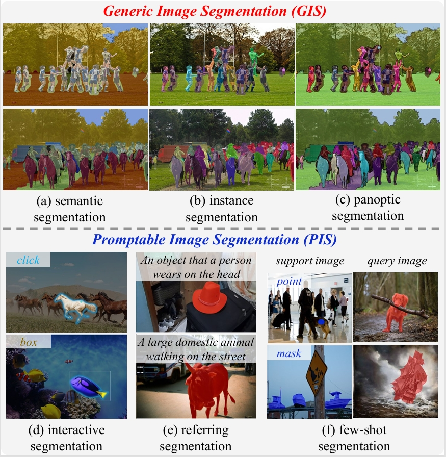

# Image Segmentation in Foundation Model Era: A Survey
***
This repository complies a collection of resources on image segmentation in foundation model era, 
and will be  continuously updated to track developments in the field. 
Please feel free to submit a pull request if you find any work missing.

## 1. Introduction
Image segmentation is a long-standing challenge in computer vision, studied continuously over several decades, as
 evidenced by seminal algorithms such as N-Cut, FCN, and MaskFormer. With the advent of foundation models (FMs), contemporary
 segmentation methodologies have embarked on a new epoch by either adapting FMs (e.g., CLIP, Stable Diffusion, DINO) for image
 segmentation or developing dedicated segmentation foundation models (e.g., SAM, SAM2). These approaches not only deliver
 superior segmentation performance, but also herald newfound segmentation capabilities previously unseen in deep learning context.
In this survey, we offer an exhaustive
 and timely overview to examine _how foundation models are
 transforming the entire field of image segmentation_ as shown in the following figure:

<p align="center">
  
</p>

***

## 2. Segmentation Knowledge Emerges From FMS
- [2.1 Segmentation Emerges from CLIP]()
- [2.2 Segmentation Emerges from DMs]()
- [2.3 Segmentation Emerges from DINO]()

***

## 3. Foundation model based GIS
- [3.1 Semantic Segmentation]()
  - [3.1.1 CLIP-based Solution]()
  - [3.1.2 DM-based Solution]()
  - [3.1.3 DINO-based Solution]()
  - [3.1.4 SAM-based Solution]()
  - [3.1.5 Composition of FMs]()
- [3.2 Instance Segmentation]()
  - [3.2.1 CLIP-based Solution]()
  - [3.2.2 DM-based Solution]()
  - [3.2.3 DINO-based Solution]()
  - [3.2.4 Composition of FMs]()
- [3.3 Panoptic Segmentation]()
  - [3.3.1 CLIP-based Solution]()
  - [3.3.2 DM-based Solution]()
  - [3.3.3 DINO-based Solution]()
  - [3.3.4 SAM-based Solution]()

***

## 4. Foundation model based PIS
- [4.1 Interactive Segmentation]()
  - [4.1.1 SAM-based Solution]()
- [4.2 Referring Segmentation]()
  - [4.2.1 DM-based Solution]()
  - [4.2.2 CLIP-based Solution]()
  - [4.2.3 Composition of FMs]()
- [4.3 Few-shot Segmentation]()
  - [4.3.1 CLIP-based Solution]()
  - [4.3.2 DM-based Solution]()
  - [4.3.3 DINO-based Solution]()
  - [4.3.4 SAM-based Solution]()
  - [4.3.5 MLLMs-based Solution]()
  - [4.3.6 In-Context Segmentation]()
## Citation

If you find our survey and repository useful, please consider citing our paper:
```bibtex
@article{zhou2024SegFMSurvey
    title={Image Segmentation in Foundation Model Era: A Survey},
    author={Zhou, Tianfei and Xia, Wang and Zhang, Fei and Chang, Boyu and Wang, Wenguan and Yuan, Ye and Konukoglu, Ender and Cremers, Daniel},
    journal={arXiv preprint arXiv:2408.12957},
    year={2024},
}
```
